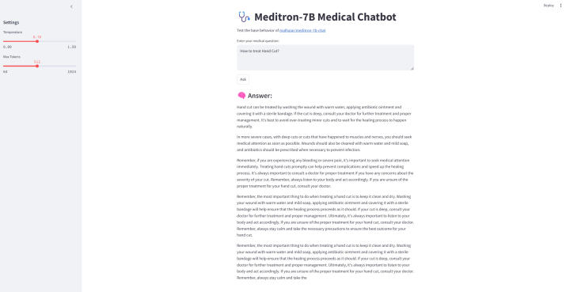
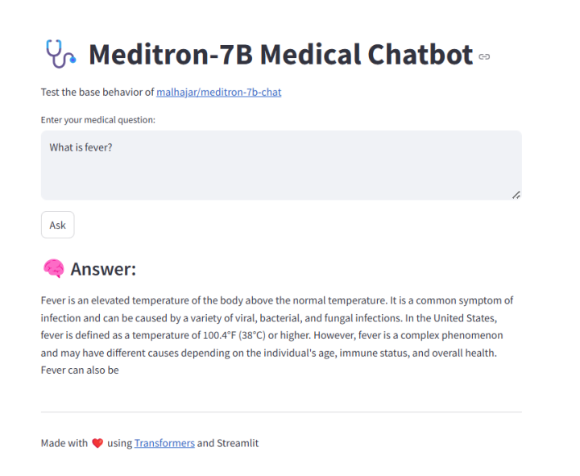

# 💕 Meditron-7B Medical Chatbot – Practice-Based Streamlit App

This project demonstrates a **practice-based integration** of the [malhajar/meditron-7b-chat](https://huggingface.co/malhajar/meditron-7b-chat) model using a user-friendly interface built with [Streamlit](https://streamlit.io/). The chatbot allows you to ask medical questions and receive informative, concise answers generated by a powerful transformer model.

> 🚀 This is a self-contained demo for learning and experimenting with deploying transformer-based models in web applications.

---

## 🗄️ Demo

### 🔍 Input Interface



### 🧐 Answer Generation



---

## 📦 Features

* Real-time medical Q\&A using Meditron-7B
* Adjustable temperature and max token settings
* Lightweight and easy to run locally
* Built with Python, Hugging Face Transformers, and Streamlit

---

## ⚙️ Setup Instructions

1. **Clone the repository**

   ```bash
   git clone https://github.com/your-username/meditron7b-streamlit-demo.git
   cd meditron7b-streamlit-demo
   ```

2. **Install dependencies**

   ```bash
   pip install -r requirements.txt
   ```

3. **Run the app**

   ```bash
   streamlit run app.py
   ```

---

## 🥪 Requirements

* Python 3.8+
* PyTorch
* `transformers`
* `streamlit`

Add these to your `requirements.txt`:

```
torch
transformers
streamlit
```

---

## 🧾 License

This is a practice-based educational project. Please refer to the license of `malhajar/meditron-7b-chat` for commercial or production use.

---

## 🙏 Acknowledgements

* 🤖 Model: [malhajar/meditron-7b-chat](https://huggingface.co/malhajar/meditron-7b-chat)
* 🌐 UI: [Streamlit](https://streamlit.io/)
* 🧠 Transformers: [Hugging Face](https://huggingface.co/transformers/)

---

## 📢 Contact

**Noor Uddin**
📧 [noor.cs2@yahoo.com](mailto:noor.cs2@yahoo.com)
Feel free to reach out for collaborations or improvements!
